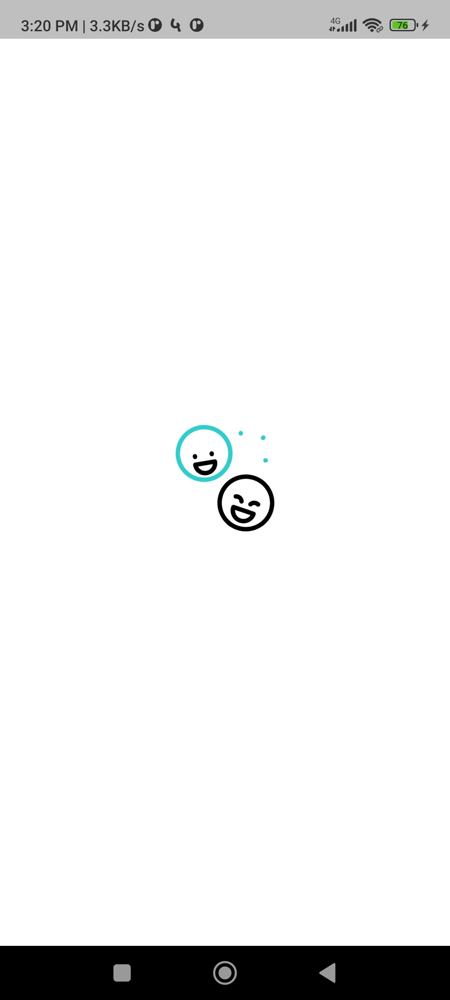
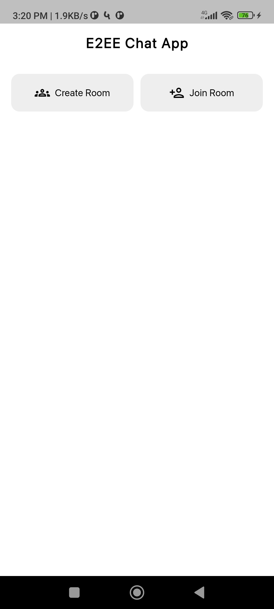
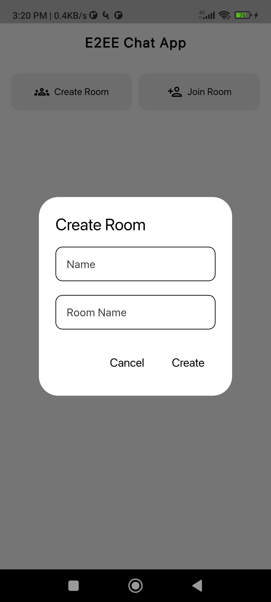
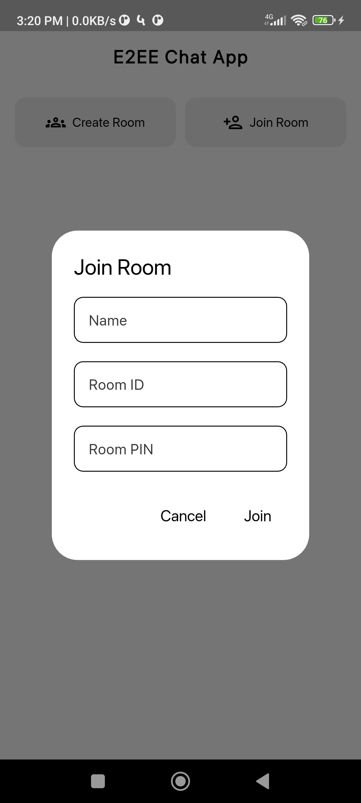
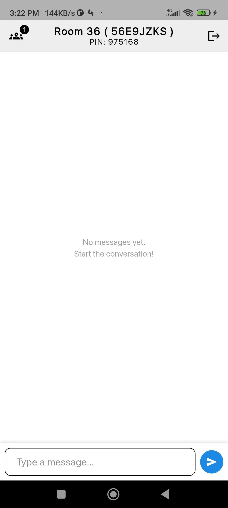
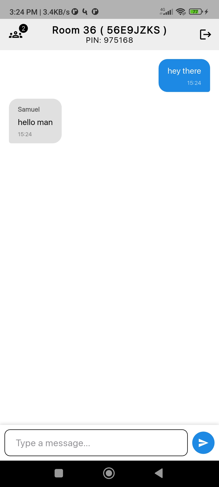
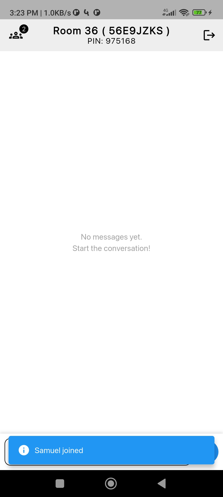
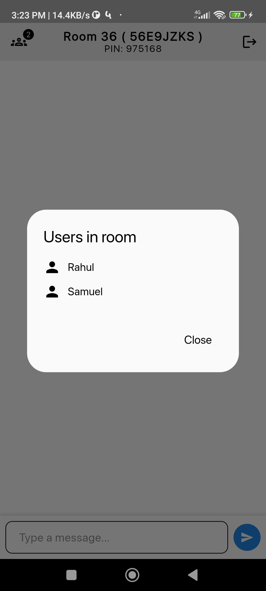
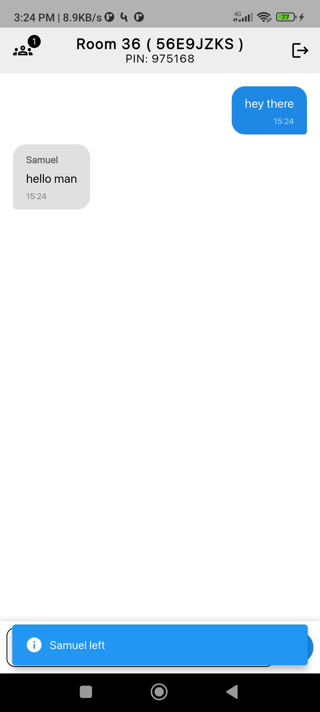

# Simple E2EE Chat Room App

A minimal end-to-end encrypted chat solution featuring a **Flutter** client and a **Go** backend, demonstrating real-time messaging and clean architecture.

## 🚀 Features

- **Real-time Messaging**: Instant message delivery using **Pusher Channels**.
- **End-to-End Encryption (E2EE)**: Secure communication using **AES-CBC**.
    - **Server-Generated PIN**: The server generates a random PIN for each room.
    - **Ephemeral Storage**: Backend uses in-memory storage; data is lost on restart.
- **Room-based Chat**: Users can create rooms or join via ID & secret PIN.
- **Clean Architecture**: Structured Flutter codebase separating Domain, Data, and Presentation.

---

## 📸 Screenshots & Demo

### 1. Getting Started
| Splash Screen | Home Screen | Create Room |
|:---:|:---:|:---:|
|  |  |  |

### 2. Join & Chat
| Join Room | Chat Room | Conversation |
|:---:|:---:|:---:|
|  |  |  |

### 3. Events & Details
| User Joined | Room Details | User Left |
|:---:|:---:|:---:|
|  |  |  |

### 🎥 Video Demos
[**▶️ Create Room Demo**](https://drive.google.com/file/d/1ibOQbvVRtamzYza_u_9h8e8N4rbVGhiF/view?usp=drive_link) • [**▶️ Join Room Demo**](https://drive.google.com/file/d/1iRwbM_6GNHsEcjgyeHy0LMWpj1Coq6ao/view?usp=drive_link)

---

## 🔐 How Encryption Works

The application uses **Symmetric Encryption** (AES-CBC) based on a shared secret (PIN).

1.  **Key Generation**:
    - The server generates a random 6-digit **PIN** when a room is created.
    - This **PIN** is hashed locally by the client using **SHA-256** to create the **Encryption Key**.

2.  **Encryption (Sending)**:
    - Message is encrypted locally using the Key and a random IV.
    - Payload sent to server: `IV:EncryptedText` (Base64).

3.  **Decryption (Receiving)**:
    - Receiver extracts IV and Encrypted Text.
    - Decrypts locally using the PIN-derived Key (entered when joining).

---

## 🏗️ Architecture & Tech Stack

### 📱 Client (Flutter)
- **Pattern**: Clean Architecture (Presentation, Domain, Data).
- **State Management**: `flutter_bloc`.
- **Encryption**: `encrypt` package (AES-CBC).
- **Network**: `pusher_channels_flutter`.

### 🖥️ Backend (Go)
- **Framework**: `gorilla/mux` for REST API routing.
- **Real-time**: `pusher-http-go` for triggering events.
- **Storage**: **In-Memory** (`map[string]*Room`).
    - *Design Decision*: Ensures privacy and simplicity. No database required.
- **API Endpoints**:
    - `POST /create-room`: Initialize room and receive Room ID & PIN.
    - `POST /join-room`: Validate room existence and notify members.
    - `POST /leave-room`: Notify room members that a user has left.
    - `POST /send-message`: Broadcast encrypted payload to subscribers.

---

## 🛠️ How to Run

### 1. Backend Setup (Go)
*Prerequisites: Go 1.25+, Pusher Account*

1.  Navigate to the server directory.
2.  Create a `.env` file:
    ```env
    PUSHER_APP_ID=your_app_id
    PUSHER_KEY=your_key
    PUSHER_SECRET=your_secret
    PUSHER_CLUSTER=your_cluster
    ```
3.  Run the server:
    ```bash
    go run main.go
    ```
    *Server starts on `http://localhost:8080`*

4.  **Expose with Ngrok (Recommended)**
    Since you are likely running the Flutter app on a physical device or emulator that cannot access your computer's `localhost` directly, use **ngrok** to expose your local server.
    ```bash
    ngrok http 8080
    ```
    *Copy the generated forwarding URL (e.g., `https://xxxx.ngrok-free.app`) and update your Flutter app's API Base URL constant.*

### 2. Client Setup (Flutter)
*Prerequisites: Flutter SDK*

1.  Clone repository and navigate to the app folder.
2.  Install dependencies:
    ```bash
    flutter pub get
    ```
3.  Configure Pusher in `lib/common/constants/pusher_constants.dart` (or equivalent).
4.  Run the app:
    ```bash
    flutter run
    ```

---

## 📱 Usage Flow

1.  **Create**: User A creates a room and receives a **Room ID** and **PIN** from the server.
2.  **Share**: User A shares Room ID + PIN with User B securely (offline).
3.  **Join**: User B enters the shared ID + PIN.
4.  **Chat**: Messages utilize the Backend to relay encrypted data. Only Users A & B can read them.
